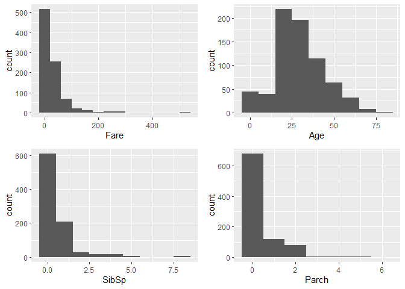
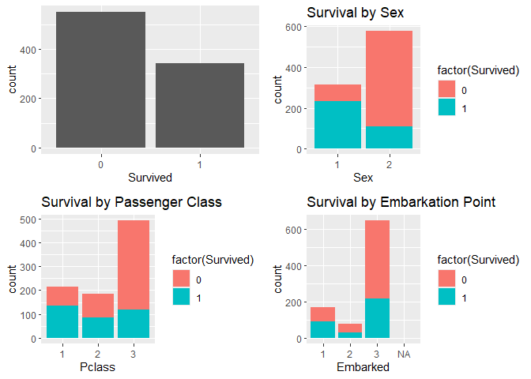
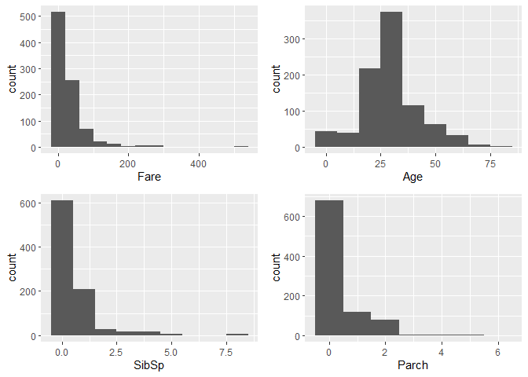
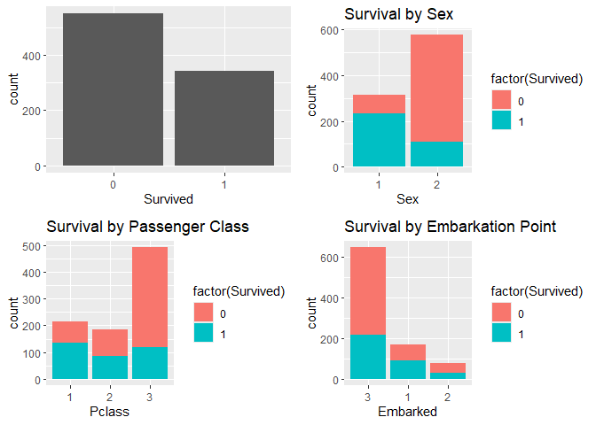
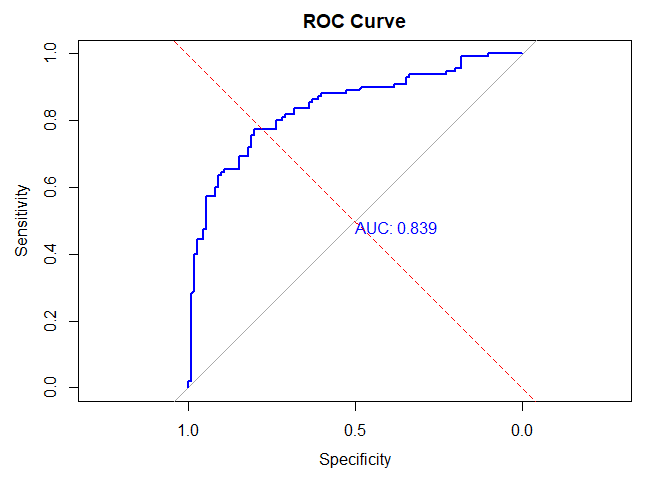

DSC1107 \| FA 5
================
Baybayon, Darlyn Antoinette B.

``` r
suppressPackageStartupMessages({
  library(tidyverse)
  library(dplyr)
  library(readr)
  library(ggplot2)
  library(stat471)
  library(caret)
  library(glmnet)
  library(cowplot)
  library(psych)
  library(pROC)
})
```

### Introduction

**The Dataset and Objectives**

``` r
data <- read_csv("train.csv", show_col_types = FALSE)
head(data)
```

    ## # A tibble: 6 × 12
    ##   PassengerId Survived Pclass Name    Sex     Age SibSp Parch Ticket  Fare Cabin
    ##         <dbl>    <dbl>  <dbl> <chr>   <chr> <dbl> <dbl> <dbl> <chr>  <dbl> <chr>
    ## 1           1        0      3 Braund… male     22     1     0 A/5 2…  7.25 <NA> 
    ## 2           2        1      1 Cuming… fema…    38     1     0 PC 17… 71.3  C85  
    ## 3           3        1      3 Heikki… fema…    26     0     0 STON/…  7.92 <NA> 
    ## 4           4        1      1 Futrel… fema…    35     1     0 113803 53.1  C123 
    ## 5           5        0      3 Allen,… male     35     0     0 373450  8.05 <NA> 
    ## 6           6        0      3 Moran,… male     NA     0     0 330877  8.46 <NA> 
    ## # ℹ 1 more variable: Embarked <chr>

The dataset contains information about passengers of the Titanic and
their survival status. It has 891 observations and 12 columns. The key
features are as follows:

- Pclass - Passenger class (1st, 2nd, 3rd)
- Sex - Male or Female
- Age - Age in years
- SibSp - no. of Siblings/spouses aboard
- Parch - no. of parents/children aboard
- Fare - Passenger fare
- Embarked - Port of Embarkation
- Survived - Survival STatus

The objective of this project is to implement logistic regression to
build a model that predicts a passenger’s survival status based on the
given information, analyze the model’s performance, and interpret the
results.

### Data Preprocessing

#### Exploratory Data Analysis

Dataset shape and data types

``` r
glimpse(data)
```

    ## Rows: 891
    ## Columns: 12
    ## $ PassengerId <dbl> 1, 2, 3, 4, 5, 6, 7, 8, 9, 10, 11, 12, 13, 14, 15, 16, 17,…
    ## $ Survived    <dbl> 0, 1, 1, 1, 0, 0, 0, 0, 1, 1, 1, 1, 0, 0, 0, 1, 0, 1, 0, 1…
    ## $ Pclass      <dbl> 3, 1, 3, 1, 3, 3, 1, 3, 3, 2, 3, 1, 3, 3, 3, 2, 3, 2, 3, 3…
    ## $ Name        <chr> "Braund, Mr. Owen Harris", "Cumings, Mrs. John Bradley (Fl…
    ## $ Sex         <chr> "male", "female", "female", "female", "male", "male", "mal…
    ## $ Age         <dbl> 22, 38, 26, 35, 35, NA, 54, 2, 27, 14, 4, 58, 20, 39, 14, …
    ## $ SibSp       <dbl> 1, 1, 0, 1, 0, 0, 0, 3, 0, 1, 1, 0, 0, 1, 0, 0, 4, 0, 1, 0…
    ## $ Parch       <dbl> 0, 0, 0, 0, 0, 0, 0, 1, 2, 0, 1, 0, 0, 5, 0, 0, 1, 0, 0, 0…
    ## $ Ticket      <chr> "A/5 21171", "PC 17599", "STON/O2. 3101282", "113803", "37…
    ## $ Fare        <dbl> 7.2500, 71.2833, 7.9250, 53.1000, 8.0500, 8.4583, 51.8625,…
    ## $ Cabin       <chr> NA, "C85", NA, "C123", NA, NA, "E46", NA, NA, NA, "G6", "C…
    ## $ Embarked    <chr> "S", "C", "S", "S", "S", "Q", "S", "S", "S", "C", "S", "S"…

**Statistical Summary**

``` r
round(t(describe(data, omit=TRUE)),4)
```

    ##          PassengerId Survived   Pclass      Age    SibSp    Parch     Fare
    ## vars          1.0000   2.0000   3.0000   6.0000   7.0000   8.0000  10.0000
    ## n           891.0000 891.0000 891.0000 714.0000 891.0000 891.0000 891.0000
    ## mean        446.0000   0.3838   2.3086  29.6991   0.5230   0.3816  32.2042
    ## sd          257.3538   0.4866   0.8361  14.5265   1.1027   0.8061  49.6934
    ## median      446.0000   0.0000   3.0000  28.0000   0.0000   0.0000  14.4542
    ## trimmed     446.0000   0.3548   2.3857  29.2692   0.2721   0.1823  21.3787
    ## mad         330.6198   0.0000   0.0000  13.3434   0.0000   0.0000  10.2362
    ## min           1.0000   0.0000   1.0000   0.4200   0.0000   0.0000   0.0000
    ## max         891.0000   1.0000   3.0000  80.0000   8.0000   6.0000 512.3292
    ## range       890.0000   1.0000   2.0000  79.5800   8.0000   6.0000 512.3292
    ## skew          0.0000   0.4769  -0.6284   0.3875   3.6829   2.7399   4.7712
    ## kurtosis     -1.2040  -1.7745  -1.2834   0.1598  17.7269   9.6881  33.1231
    ## se            8.6217   0.0163   0.0280   0.5436   0.0369   0.0270   1.6648

Null

``` r
sapply(data, function(x) sum(is.na(x)))
```

    ## PassengerId    Survived      Pclass        Name         Sex         Age 
    ##           0           0           0           0           0         177 
    ##       SibSp       Parch      Ticket        Fare       Cabin    Embarked 
    ##           0           0           0           0         687           2

**Data Cleaning**

Drop irrelevant columns and convert categorical variables into numerical
format by label encoding.

``` r
data <- data %>%
  select(-PassengerId, -Name, -Cabin,-Ticket) %>%
  mutate(
    Sex = as.numeric(factor(Sex)),
    Embarked = as.numeric(factor(Embarked)),
    across(c(Survived, Pclass,Sex, Embarked), as.factor)
  )
  
head(data)
```

    ## # A tibble: 6 × 8
    ##   Survived Pclass Sex     Age SibSp Parch  Fare Embarked
    ##   <fct>    <fct>  <fct> <dbl> <dbl> <dbl> <dbl> <fct>   
    ## 1 0        3      2        22     1     0  7.25 3       
    ## 2 1        1      1        38     1     0 71.3  1       
    ## 3 1        3      1        26     0     0  7.92 3       
    ## 4 1        1      1        35     1     0 53.1  3       
    ## 5 0        3      2        35     0     0  8.05 3       
    ## 6 0        3      2        NA     0     0  8.46 2

``` r
round(t(describe(data, omit=TRUE)),4)
```

    ##               Age    SibSp    Parch     Fare
    ## vars       4.0000   5.0000   6.0000   7.0000
    ## n        714.0000 891.0000 891.0000 891.0000
    ## mean      29.6991   0.5230   0.3816  32.2042
    ## sd        14.5265   1.1027   0.8061  49.6934
    ## median    28.0000   0.0000   0.0000  14.4542
    ## trimmed   29.2692   0.2721   0.1823  21.3787
    ## mad       13.3434   0.0000   0.0000  10.2362
    ## min        0.4200   0.0000   0.0000   0.0000
    ## max       80.0000   8.0000   6.0000 512.3292
    ## range     79.5800   8.0000   6.0000 512.3292
    ## skew       0.3875   3.6829   2.7399   4.7712
    ## kurtosis   0.1598  17.7269   9.6881  33.1231
    ## se         0.5436   0.0369   0.0270   1.6648

**Data visualization**

``` r
plot_grid(
  ggplot(data, aes(x=Fare)) + geom_histogram(binwidth = 40),
  ggplot(data, aes(x=Age)) + geom_histogram(binwidth = 10),
  ggplot(data, aes(x=SibSp)) + geom_histogram(binwidth = 1),
  ggplot(data, aes(x=Parch)) + geom_histogram(binwidth = 1),
  ncol= 2
)
```

    ## Warning: Removed 177 rows containing non-finite outside the scale range
    ## (`stat_bin()`).

<!-- -->

``` r
plot_grid(
  ggplot(data, aes(x=Survived)) + geom_bar(),
  ggplot(data, aes(x=Sex)) + geom_bar(aes(fill= factor(Survived))) +
    labs(title="Survival by Sex"),
  ggplot(data, aes(x=Pclass)) + geom_bar(aes(fill= factor(Survived))) +
    labs(title="Survival by Passenger Class"),
  ggplot(data, aes(x=Embarked)) + geom_bar(aes(fill= factor(Survived))) +
    labs(title="Survival by Embarkation Point"),
  ncol=2
)
```

<!-- -->

**Handle null values**

From the EDA, we found that Embarked column has 2 missing values and Age
column has 177. Handle the missing values by imputation.

``` r
data_clean <- data %>%
  mutate(
    Age = if_else(is.na(Age), median(Age, na.rm = TRUE), Age),
    Embarked = if_else(is.na(Embarked), factor(3), Embarked)
  )
```

``` r
plot_grid(
  ggplot(data_clean, aes(x=Fare)) + geom_histogram(binwidth = 40),
  ggplot(data_clean, aes(x=Age)) + geom_histogram(binwidth = 10),
  ggplot(data_clean, aes(x=SibSp)) + geom_histogram(binwidth = 1),
  ggplot(data_clean, aes(x=Parch)) + geom_histogram(binwidth = 1),
  ncol= 2
)
```

<!-- -->

``` r
plot_grid(
  ggplot(data_clean, aes(x=Survived)) + geom_bar(),
  ggplot(data_clean, aes(x=Sex)) + geom_bar(aes(fill= factor(Survived))) +
    labs(title="Survival by Sex"),
  ggplot(data_clean, aes(x=Pclass)) + geom_bar(aes(fill= factor(Survived))) +
    labs(title="Survival by Passenger Class"),
  ggplot(data_clean, aes(x=Embarked)) + geom_bar(aes(fill= factor(Survived))) +
    labs(title="Survival by Embarkation Point"),
  ncol=2
)
```

<!-- -->

**Splitting the dataset**

Split dataset into training and testing set (80-20 split). Oversample
the minority class (survivors) to address class imbalance.

``` r
set.seed(123)
table(data_clean$Survived)
```

    ## 
    ##   0   1 
    ## 549 342

``` r
data_clean <- upSample(x = data_clean[, -1], y = data_clean$Survived)
names(data_clean)[ncol(data_clean)] <- "Survived"
table(data_clean$Survived)
```

    ## 
    ##   0   1 
    ## 549 549

``` r
n <- nrow(data_clean)
train_samples <- sample(1:n, round(0.8*n))

data_train <- data_clean[train_samples, ]
data_test <- data_clean[-train_samples, ]
```

### Model Implementation

**Training the model on the training set**

``` r
model_logistic <- glm(Survived ~ Pclass + Sex + Age + SibSp + Parch + Fare + Embarked, 
                      data=data_train, family="binomial")
summary(model_logistic)
```

    ## 
    ## Call:
    ## glm(formula = Survived ~ Pclass + Sex + Age + SibSp + Parch + 
    ##     Fare + Embarked, family = "binomial", data = data_train)
    ## 
    ## Coefficients:
    ##              Estimate Std. Error z value Pr(>|z|)    
    ## (Intercept)  4.408852   0.489799   9.001  < 2e-16 ***
    ## Pclass2     -1.158610   0.307148  -3.772 0.000162 ***
    ## Pclass3     -2.197245   0.307504  -7.145 8.97e-13 ***
    ## Sex2        -2.648478   0.203866 -12.991  < 2e-16 ***
    ## Age         -0.046134   0.008073  -5.715 1.10e-08 ***
    ## SibSp       -0.474552   0.123233  -3.851 0.000118 ***
    ## Parch        0.020709   0.124956   0.166 0.868372    
    ## Fare         0.004085   0.003260   1.253 0.210212    
    ## Embarked1    0.270138   0.237941   1.135 0.256243    
    ## Embarked2    0.173205   0.330314   0.524 0.600024    
    ## ---
    ## Signif. codes:  0 '***' 0.001 '**' 0.01 '*' 0.05 '.' 0.1 ' ' 1
    ## 
    ## (Dispersion parameter for binomial family taken to be 1)
    ## 
    ##     Null deviance: 1217.17  on 877  degrees of freedom
    ## Residual deviance:  801.68  on 868  degrees of freedom
    ## AIC: 821.68
    ## 
    ## Number of Fisher Scoring iterations: 5

**Predict outcomes on the test set**

``` r
predictions <- predict(model_logistic, newdata = data_test, type="response")
prediction_class <- factor(if_else( predictions > 0.5, 1, 0))
```

### Model Evaluation

**Performance metrics**

``` r
conf_matrix <- confusionMatrix(data_test$Survived, prediction_class)$table

cat("Confusion Matrix:\n")
```

    ## Confusion Matrix:

``` r
print(conf_matrix)
```

    ##           Reference
    ## Prediction  0  1
    ##          0 87 23
    ##          1 25 85

``` r
TN <- conf_matrix[1,1]
FP <- conf_matrix[1,2]  
FN <- conf_matrix[2,1]  
TP <- conf_matrix[2,2]  

accuracy <- (TP + TN) / sum(conf_matrix)
precision <- TP / (TP + FP)
recall <- TP / (TP + FN)
f1_score <- 2 * (precision * recall) / (precision + recall)


data.frame(
  Metric = c("Accuracy", "Precision", "Recall", "F-1 Score"),
  Value = round(c(accuracy, precision, recall, f1_score),4)
)
```

    ##      Metric  Value
    ## 1  Accuracy 0.7818
    ## 2 Precision 0.7870
    ## 3    Recall 0.7727
    ## 4 F-1 Score 0.7798

ROC Curve and AUC score

``` r
roc_curve <- roc(data_test$Survived, predictions)
```

    ## Setting levels: control = 0, case = 1

    ## Setting direction: controls < cases

``` r
plot(roc_curve, col = "blue", main = "ROC Curve", print.auc = TRUE)

abline(a = 0, b = 1, lty = 2, col = "red")
```

<!-- -->

### Results Interpretation and Discussion

**Summary**

``` r
summary(model_logistic)
```

    ## 
    ## Call:
    ## glm(formula = Survived ~ Pclass + Sex + Age + SibSp + Parch + 
    ##     Fare + Embarked, family = "binomial", data = data_train)
    ## 
    ## Coefficients:
    ##              Estimate Std. Error z value Pr(>|z|)    
    ## (Intercept)  4.408852   0.489799   9.001  < 2e-16 ***
    ## Pclass2     -1.158610   0.307148  -3.772 0.000162 ***
    ## Pclass3     -2.197245   0.307504  -7.145 8.97e-13 ***
    ## Sex2        -2.648478   0.203866 -12.991  < 2e-16 ***
    ## Age         -0.046134   0.008073  -5.715 1.10e-08 ***
    ## SibSp       -0.474552   0.123233  -3.851 0.000118 ***
    ## Parch        0.020709   0.124956   0.166 0.868372    
    ## Fare         0.004085   0.003260   1.253 0.210212    
    ## Embarked1    0.270138   0.237941   1.135 0.256243    
    ## Embarked2    0.173205   0.330314   0.524 0.600024    
    ## ---
    ## Signif. codes:  0 '***' 0.001 '**' 0.01 '*' 0.05 '.' 0.1 ' ' 1
    ## 
    ## (Dispersion parameter for binomial family taken to be 1)
    ## 
    ##     Null deviance: 1217.17  on 877  degrees of freedom
    ## Residual deviance:  801.68  on 868  degrees of freedom
    ## AIC: 821.68
    ## 
    ## Number of Fisher Scoring iterations: 5

A logistic regression model was trained to predict the likelihood of
survival of passengers of the Titanic based on Passenger Class (Pclass),
Sex, Age, No. of Siblings/Spouses aboard (SibSp), No. of
Parents/Children aboard (Parch), Fare, and Port of Embarkation
(Embarked). Among these features, Pclass, Sex, Age, and SibSp were found
to be statistically significant (p \< 0.05).

The logistic regression model exhibited good overall performance, with
an accuracy of 78.18%, precision of 78.70%, recall of 77.27%, and an F1
score of 77.98%. The AUC (Area under Curve) of the ROC (Receiver
Operating Characteristic) was 0.839, which indicates the model’s strong
ability to distinguishing between survivors and non-survivors.

**Significant Features and interpretation**

Pclass2 (B= -1.159, p = 0.000162) had lower odds of survival compared to
Pclass1; Pclass3 (B = -2.197, p = 8.97e-13) had lower odds of survival
compared to class1m with a stronger impact than Pclass2. These resuls
indicate that passengers in lower classes were more unlikely to survive.

Sex2 (B = -2.648, p \< 2e-16) had a strong impact on survival status,
with males being significantly less likely to survive than females.

Age (B = -0.046, p = 1.10e-08) was also negatively correlated with
survival, decreasing the likelihood of survival as age increases.

SibSp (B = -0.47, p = 0.000118) also negatively impacted survival, which
indicate that individuals in larger families struggled to survive.

**Recommendations**

To further improve the performance of this model, some strategies can be
implemented. Feature engineering can help create new predictors. For
example, SibSp and Parch may be combined to a new variable, FamilySize.
